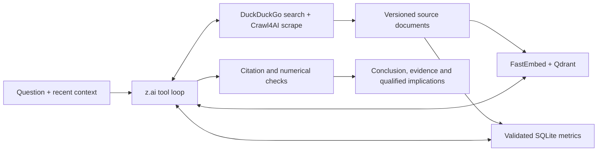

# London Market Monitor

A London office research agent: **z.ai tool calling → DuckDuckGo SDK search + Crawl4AI extraction → FastEmbed + Qdrant retrieval → cited synthesis**, with SQLite retaining normalized metrics and source versions. Only the configured z.ai provider, key, endpoint and model are accepted. Synthetic and offline execution paths are removed.

## Run locally

```bash
uv sync
# If you do not already have .env:
cp -n .env.example .env
# Set ZAI_API_KEY; retain your intended ZAI_API_BASE and LLM_MODEL.
# Set CRAWL4AI_API_TOKEN to a random token (openssl rand -hex 32).
docker compose up -d --build
```

Open [localhost:8000](http://localhost:8000). `.env` loads automatically for local Python commands; exported variables take precedence. `LLM_PROVIDER=z.ai`, `ZAI_API_KEY`, `ZAI_API_BASE` and `LLM_MODEL` are required; `.env.example` shows the intended route and model. Missing configuration or unsupported providers fail at startup. Rejected keys and model failures return actionable errors. There is no silent model, provider or billing-route fallback. Model calls consume the configured account's usage.

Compose runs three services: app, Qdrant and pinned Crawl4AI `0.9.3`. Crawl4AI includes its browser and PDF parser; no Firecrawl checkout, separate queue or database is required. Ports bind only to localhost (`8000`, `6333`, `11235`). Set `CRAWL4AI_API_TOKEN` in `.env`; the app uses it for authenticated crawler calls. LLM credentials are never passed to the crawler. Existing app and Qdrant volumes remain unchanged.

For development with the dependencies already running:

```bash
uv run london-monitor serve
uv run london-monitor ask "Compare City and West End office demand using recent reports."
uv run london-monitor refresh
```

Live SQLite data lives in `LONDON_DATA_DIR/live`. Documents, validated metrics and refresh briefings persist across app restarts.

## Research and refresh

An initial retrieval supplies stored evidence. The model then chooses `query_market_metrics`, `search_market_evidence`, `search_web` and `scrape_source` inside a LangGraph loop. Focused instructions cover market pulse, submarket comparison, supply and macro/demand. Chat permits six tool rounds, three web searches, six page scrapes and 180 seconds, then returns an explicitly incomplete response if necessary.



Discovery uses the `ddgs` SDK in its standard metasearch `auto` mode (`DDGS_BACKEND=duckduckgo` restricts it to DuckDuckGo), then ranks preferred broker, official and developer sources first. Auto mode can use other search engines when DuckDuckGo is unavailable. Search snippets are leads only. Public HTML and readable text PDFs are extracted by Crawl4AI without LLM extraction or stealth options. The app validates public target addresses; Crawl4AI enforces its egress policy for browser connections, redirects and PDF downloads. Inaccessible or undated sources remain explicitly limited. Source content is untrusted data, never instructions.

SQLite retains canonical URL/content-checksum versions, separate publication and retrieval times, and metric definitions with supporting quotations. Unknown dates stay unknown. Identical content from the same source is deduplicated. Real semantic embeddings use `BAAI/bge-small-en-v1.5` in a separate 384-dimensional collection; collection identity is checked before reuse.

Refresh extracts numerical observations; chat page reads retain source text without an extra metric-extraction model call. Strict extraction rejects ambiguous numerical observations from SQL comparisons while retaining source text. Comparisons require matching units and definitions, align observation periods, calculate differences in Python and cite both inputs. Conflicting reports remain separate. Citation and number checks detect some grounding errors; they do not establish source truth or guarantee semantic entailment. Invalid structured output gets one repair attempt, then an explicit evidence-only fallback.

**Refresh data** runs a bounded five-topic collection (four office submarkets plus macro/demand; at most 12 sources and five minutes). Its saved briefing distinguishes a first baseline, newly discovered documents, revised content, comparable metric changes, conflicts and failures. Follow-up chat can retain the previous complete tool transcript and evidence. Conversations are in memory; documents and briefings survive restarts. Use one app worker for this iteration.

## API

- `POST /api/chat`: question and optional `conversation_id`; returns answer, citations, evidence, trace, mode, freshness and incomplete status.
- `GET /api/sources`, `GET /api/metrics`: source versions and validated observations.
- `POST /api/ingest`: supplied text/Markdown with title, publisher, optional URL/date, submarket and category. This endpoint does not fetch the URL or invent SQL observations.
- `GET /api/status`: mode, model, source count and last refresh.
- `POST /api/refresh` with `{}`; `GET /api/refresh` reads the saved briefing.

Interactive schemas are at [localhost:8000/docs](http://localhost:8000/docs). Tool traces expose activity, failures, source counts, duration and available token usage; private model reasoning is not returned. Optional LangSmith tracing is off by default and may transmit source content if enabled.

## Validation

```bash
uv run ruff check .
uv run pytest
docker compose config --quiet
# Real configured model and running Crawl4AI/Qdrant; consumes account usage:
uv run london-monitor smoke
```

The focused suite checks configuration, real SQLite behavior, source provenance, numerical
validation, arithmetic, refresh comparisons and URL boundaries. Canned model answers and
synthetic end-to-end cases have been removed. Live acceptance is exercised in the built-in
browser against the configured model and real collected reports.

The container places Hugging Face/Xet downloads in the writable app volume. Embedding
inference is serialized in batches of 16 with two CPU threads to bound concurrent chat/refresh
memory. No Docker data volumes need to be reset.

See [architecture and limits](docs/ARCHITECTURE.md) and
[browser acceptance results](deliverables/browser-acceptance.md).
