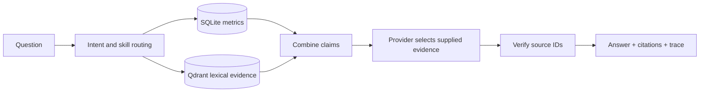

# London Market Monitor

Evidence-grounded London office market intelligence with an offline-first API, CLI and browser dashboard. The demo UI and seeded answers identify synthetic data where it appears.

## Quickstart

```bash
uv sync
uv run london-monitor init-demo
uv run london-monitor ask "What is happening to prime rents in the City?"
uv run london-monitor smoke
uv run london-monitor eval
uv run pytest
uv run ruff check src tests scripts
uv run london-monitor serve --port 8000
```

Open [localhost:8000](http://localhost:8000). Stop the server before running another command against the same data directory: local Qdrant permits one owner. The API serves `POST /api/chat`, `GET /api/sources`, `POST /api/ingest`, and `GET /api/metrics`. Set `LONDON_DATA_DIR` to move the local SQLite and Qdrant data. Environment variables are read from the shell; `.env` is not auto-loaded. Copy `.env.example` when configuring an optional OpenAI-compatible selector.

For a container run, build the image first. The image uses `.runtime` by default; a named volume is optional:

```bash
docker build -t london-monitor .
docker run --rm -p 8000:8000 london-monitor
# Optional persistence (Docker initializes the volume with image directory ownership):
docker run --rm -p 8000:8000 -v london-market-data:/app/.runtime london-monitor
```

## How it works

`MarketService` owns SQLite, the local Qdrant collection, ingestion and the graph. The graph routes a question to typed metric, supply and evidence tools, combines their claims, optionally asks a provider to select supplied evidence, then verifies every claim against stored source IDs before returning citations and a trace. `OfflineProvider` is the default; it returns verified evidence directly.



SQLite is authoritative for structured numbers and periods; Qdrant supplies ranked text excerpts. Every `Source` carries publisher, URL, publication date, retrieval time, checksum and demo status. `Metric` carries metric, value, unit, period, submarket and source ID. Citations expose the source and excerpt used for each claim.

`eval` runs the repository's grounded-answer cases and exits non-zero when a case fails. `smoke` exercises database, graph, evidence, citations and the final verification node. Structured logs record run ID, tools, retrieval count, duration, failures and token usage; optional LangSmith tracing is off by default.

The PoC deliberately uses deterministic hashed lexical vectors, one local worker, synthetic seed data and text/Markdown ingestion. URLs are metadata only. Production needs stronger embeddings, server storage, curated connectors, freshness SLAs, access control and multi-worker coordination.

## Repository map

- `src/london_monitor/models.py` — shared Pydantic contracts.
- `src/london_monitor/service.py` — service boundary.
- `src/london_monitor/agent/graph.py` — typed workflow and grounding verification.
- `src/london_monitor/api.py` and `src/london_monitor/web/` — FastAPI and static UI.
- `scripts/build_slides.py` — reproducible five-slide stakeholder deck.

Build the deck with `uv run python scripts/build_slides.py`.

## Example questions and ingestion

- Give me the latest London office market pulse.
- Compare City and West End and explain why conditions differ.
- What changed in City prime rents versus the previous period?
- What evidence supports flight-to-quality?
- What are the supply-side risks? Where do vacancy sources disagree?

Submit plain text or Markdown through `POST /api/ingest`, with `title`, `publisher`,
`text`, `published_at` (ISO date), optional `url`, `category`, and `submarket`.
The URL is not fetched. New text cannot create authoritative numerical metrics;
those require validated `Metric` records in SQLite. API schemas and examples are at `/docs`.

Optional model selection: export `LLM_PROVIDER=openai`, `LLM_MODEL`, and
`OPENAI_API_KEY` in your shell. `OPENAI_BASE_URL` selects a compatible endpoint.
The model orders existing evidence; it cannot author new market facts. No paid calls
are used in validation. Historical questions support explicit quarters such as `2025-Q4`.
Publication dates remain distinct from metric periods. Numeric commentary is withheld
from synthesis; conflicting structured values remain separate, with a warning.

Implementation references: [LangGraph graph API](https://docs.langchain.com/oss/python/langgraph/graph-api)
and [Qdrant client](https://github.com/qdrant/qdrant-client).
