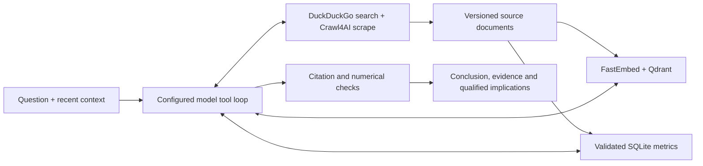

# London Market Monitor

A Python research agent for London office markets, with a FastAPI dashboard and CLI.
LangGraph orchestrates model tool calls, `ddgs` discovers sources, Crawl4AI extracts content,
FastEmbed and Qdrant retrieve evidence, and SQLite stores versioned documents and validated
metrics. Responses include citations, evidence gaps and verification status.

The working PoC supports on-demand research, manual refresh, cited briefs and follow-up questions.
Scheduled alerts, private-data connectors and autonomous decisions are outside its current scope.
Research depends on accessible evidence; partial responses are labeled rather than presented as
complete conclusions. The application is live-only; offline commands run test fixtures.

## Run locally

Requires Python 3.12+, `uv`, and Docker Compose.

```bash
uv sync --frozen
# If you do not already have .env:
cp -n .env.example .env
# Choose LLM_PROVIDER and LLM_MODEL; set its API_KEY and API_BASE (see below).
# Set CRAWL4AI_API_TOKEN to a random token (openssl rand -hex 32).
docker compose up -d --build
```

Open [localhost:8000](http://localhost:8000). `.env` loads automatically for local Python commands;
exported variables take precedence. Configure a provider as described below. Missing configuration
or unsupported providers fail at startup. Rejected keys and model failures return actionable errors.
There is no silent model, provider or billing-route fallback. Model calls consume the configured
account's usage.

Compose runs three services: app, Qdrant and pinned Crawl4AI `0.9.3`. Crawl4AI includes its browser and PDF parser; no Firecrawl checkout, separate queue or database is required. Ports bind only to localhost (`8000`, `6333`, `11235`). Set `CRAWL4AI_API_TOKEN` in `.env`; the app uses it for authenticated crawler calls. LLM credentials are never passed to the crawler. Existing app and Qdrant volumes remain unchanged.

For a host-based development server, keep the dependency services running and stop the
containerized app so port 8000 is available:

```bash
docker compose up -d qdrant crawl4ai
docker compose stop app
uv run london-monitor serve --port 8000
```

After stopping the host server, CLI commands use the same host `.env` and data directory:

```bash
uv run london-monitor ask "Compare City and West End office demand using recent reports."
uv run london-monitor refresh
```

The host `.runtime` directory and Docker app volume are separate SQLite stores. Use one app
process with a consistent SQLite/Qdrant dataset; do not run independent app instances against
the same Qdrant collection. Changing `LONDON_DATA_DIR` alone does not isolate remote vectors.

Live SQLite data lives in `$LONDON_DATA_DIR/live/market.sqlite` (default `.runtime/live/market.sqlite`). Documents, validated metrics and refresh briefings persist across app restarts.

## LLM provider and model selection

Supported provider IDs are `z.ai`, `openai`, `anthropic`, `gemini`, `deepseek`, and `openrouter`.
All use the existing OpenAI SDK's Chat Completions interface; no extra SDK installation is needed.

### Configure a provider

Set `LLM_PROVIDER`, `LLM_MODEL`, and the selected provider's `<PREFIX>_API_KEY` and
`<PREFIX>_API_BASE`. All four are required; endpoints and models are never selected automatically.
`CRAWL4AI_API_TOKEN` is also required for the research service.

| `LLM_PROVIDER` | Prefix | API base | Example model ID |
| --- | --- | --- | --- |
| `z.ai` | `ZAI` | Keep the endpoint for your account/plan; `.env.example` retains the existing coding route | `glm-5.3-flash` (existing project configuration) |
| `openai` | `OPENAI` | `https://api.openai.com/v1` | [`gpt-5-mini`](https://developers.openai.com/api/docs/models/gpt-5-mini) |
| `anthropic` | `ANTHROPIC` | `https://api.anthropic.com/v1` | [`claude-sonnet-5`](https://platform.claude.com/docs/en/models/overview) |
| `gemini` | `GEMINI` | `https://generativelanguage.googleapis.com/v1beta/openai/` | [`gemini-3.8-flash`](https://ai.google.dev/gemini-api/docs/models) |
| `deepseek` | `DEEPSEEK` | `https://api.deepseek.com` | [`deepseek-flash`](https://api-docs.deepseek.com/) |
| `openrouter` | `OPENROUTER` | `https://openrouter.ai/api/v1` | [`openai/gpt-5-mini`](https://openrouter.ai/openai/gpt-5-mini) |

These are editable examples, not a benchmark ranking or a guarantee of account access. Use the
exact API model ID from your provider's catalog, not a chatbot's display name. Model aliases can
change underneath you; use a dated version where available if repeatability matters.

For example, edit `.env` to use Gemini:

```dotenv
LLM_PROVIDER=gemini
LLM_MODEL=gemini-3.8-flash
GEMINI_API_KEY=replace-with-your-api-key
GEMINI_API_BASE=https://generativelanguage.googleapis.com/v1beta/openai/
# Keep CRAWL4AI_API_TOKEN and the other research-service settings.
```

To offer additional providers in the dashboard, set each one's key, base and `<PREFIX>_MODEL`:

```dotenv
ANTHROPIC_API_KEY=replace-with-your-api-key
ANTHROPIC_API_BASE=https://api.anthropic.com/v1
ANTHROPIC_MODEL=claude-sonnet-5
```

The primary provider always uses `LLM_MODEL`; its `<PREFIX>_MODEL` is only used when it is secondary.
Incomplete secondary configurations are omitted from the selector. Restart the host server after
editing `.env`, or run `docker compose up -d --build app` for Compose. Only provider IDs and model
IDs reach the browser; keys and endpoints stay on the server. Dashboard selection affects that
chat request; refresh and CLI operations use the server default. Start new research when switching
providers/models so provider-specific tool history is not reused across incompatible models.

For OpenRouter as the primary provider:

```dotenv
LLM_PROVIDER=openrouter
LLM_MODEL=openai/gpt-5-mini
OPENROUTER_API_KEY=replace-with-your-openrouter-key
OPENROUTER_API_BASE=https://openrouter.ai/api/v1
```

For secondary use, set `OPENROUTER_MODEL` instead of changing `LLM_MODEL`. Use an OpenRouter
model slug including its organization prefix, such as `openai/gpt-5-mini`.

### Choose a model for this agent

- Start with an efficient general-purpose text model with **function/tool calling** and reliable
  JSON output. A Flash or Mini model is a reasonable first evaluation candidate for routine
  extraction and market briefs; the examples above are starting points, not measured winners.
- Compare a stronger general-purpose model if the first one repeatedly misses evidence, misuses
  tools or fails validation. Check grounded claims and completeness, not just fluent wording.
  Research has a 180-second budget and six tool rounds; slower reasoning can reduce completeness.
- Choose a model with enough context for source passages and follow-up history. Each response is
  capped at 8,192 tokens (including reasoning where the provider counts it). Image, audio,
  embedding-only and Responses-only models do not fit this Chat Completions adapter.
- Check the linked catalogs for current prices, availability and limits before enabling live use.
  Without an API key, use the offline validation commands below; the live dashboard still requires
  a configured provider. Offline results validate application behavior, not a hosted model's quality.

### Compatibility details

[Anthropic's compatibility layer](https://platform.claude.com/docs/en/cli-sdks-libraries/libraries/openai-sdk)
is intended for evaluation and is not recommended by Anthropic as a long-term production solution.
It supports tool calls but ignores `response_format`; this adapter omits that field and relies on
JSON instructions plus the application's validation/repair path. Native Claude structured outputs,
provider prompt caching and advanced thinking controls are not exposed by this adapter.

[Gemini's OpenAI endpoint](https://ai.google.dev/gemini-api/docs/openai) supports function calling.
The adapter preserves [tool-call thought signatures](https://ai.google.dev/gemini-api/docs/generate-content/thought-signatures)
in private conversation state. It requests JSON mode only when no tools are offered, avoiding
model-dependent combinations of tools and JSON mode. Tool rounds rely on the same JSON instructions
and application validation. This is the Gemini Developer API route, not Vertex AI authentication.

[DeepSeek supports OpenAI-compatible calls](https://api-docs.deepseek.com/); returned
`reasoning_content` is retained for subsequent tool turns and never included in public traces.
OpenAI uses `max_completion_tokens` to accommodate reasoning models; other providers use
`max_tokens`. Existing z.ai calls retain their low reasoning-effort setting. No provider error
triggers a fallback to a different account or endpoint.

[OpenRouter](https://openrouter.ai/docs/quickstart) uses its own API key and billing account.
Choose a model/endpoint supporting both tools and JSON output; not every catalog model qualifies.
The adapter sets [`require_parameters=true` and `allow_fallbacks=false`](https://openrouter.ai/docs/guides/routing/provider-selection)
to reject unsupported routes and disable upstream fallback. OpenRouter still selects the initial
upstream endpoint; this does not pin one endpoint across requests. Use a concrete model slug
rather than an automatic router or latest-model alias for predictable model selection.
[Reasoning metadata](https://openrouter.ai/docs/guides/best-practices/reasoning-tokens) is preserved
unchanged in private tool-call history and excluded from public traces. No live OpenRouter calls
were used to validate this integration.

## Research and refresh

An initial retrieval supplies stored evidence. The model then chooses `compare_market_changes`, `query_market_metrics`, `search_market_evidence`, `search_web` and `scrape_source` inside a LangGraph loop. Focused instructions cover market pulse, submarket comparison, supply and macro/demand. Chat permits six tool rounds, three web searches, six page scrapes and 180 seconds, then returns an explicitly incomplete response if necessary.



Discovery uses the `ddgs` SDK in its standard metasearch `auto` mode (`DDGS_BACKEND=duckduckgo` restricts it to DuckDuckGo), then ranks preferred broker, official and developer sources first. Auto mode can use other search engines when DuckDuckGo is unavailable. Search snippets are leads only. Public HTML and readable text PDFs are extracted by Crawl4AI without LLM extraction or stealth options. The app validates public target addresses; Crawl4AI enforces its egress policy for browser connections, redirects and PDF downloads. Inaccessible or undated sources remain explicitly limited. Source content is untrusted data, never instructions.

SQLite retains canonical URL/content-checksum versions, separate publication and retrieval times, and metric definitions with supporting quotations. Unknown dates stay unknown. Identical content from the same source is deduplicated. Real semantic embeddings use `BAAI/bge-small-en-v1.5` in a separate 384-dimensional collection; collection identity is checked before reuse.

Refresh extracts numerical observations; chat page reads retain source text without an extra metric-extraction model call. Strict extraction rejects ambiguous numerical observations from SQL comparisons while retaining source text. Comparisons require matching units and definitions, align observation periods, calculate differences in Python and cite both inputs. Conflicting reports remain separate. Citation and number checks detect some grounding errors; they do not establish source truth or guarantee semantic entailment. Invalid output gets one repair attempt. If verification still fails, the agent retains only
individually verified claims as a partial brief; if none survive, it returns labeled source excerpts.
Neither fallback retains an unverified overall synthesis.

**Refresh data** runs a bounded five-topic collection (four office submarkets plus macro/demand; at most 12 sources and five minutes). Its saved briefing distinguishes a first baseline, newly discovered documents, revised content, comparable metric changes, conflicts and failures. Follow-up chat can retain the previous complete tool transcript and evidence. Conversations are in memory; documents and briefings survive restarts. Use one app worker for this iteration.

## Dashboard usage

1. Choose **Monitor**, **Investigate**, or **Prepare**, or write a question with a market and period.
2. Ask, then read **In brief** and the investigation verdict where applicable.
3. Check the key claim with **Verify evidence**, including its definition and reporting period.
4. Ask a follow-up with **Continue this conversation** checked; copy the brief and sources for the meeting.
5. Use **Refresh data** when you need a new collection baseline or comparison. The first refresh
   establishes a baseline, not a change story.

Example questions:

- “What changed versus the previous period?” prioritizes material deltas and new evidence.
- “Is West End outperforming City?” tests matched indicators and returns a verdict.
- “What evidence supports flight-to-quality?” checks quality-specific evidence and gaps.
- “Where do the sources disagree?” retains incompatible numbers, definitions and periods.
- “Give me the five most important developments this month.” uses a publication-month window
  and returns fewer than five when coverage cannot support five developments.
- “Forecast the exact City prime rent to the penny in Q4 2035.” should admit insufficient evidence.

Briefs open with **In brief**, a synthesis of the answer and its implications, followed by expandable
findings: what changed, key metrics, emerging signals, risks, opportunities and a watchlist.
The opening contains at most 80 words and connects the findings. If synthesis is unavailable,
verified details remain with a warning. Partial or evidence-only responses have no verified overall
summary; read their limitations.
Open **Verify evidence** beside a claim to inspect source values, original quotations and derived
calculations. Copy a meeting brief with its source list. Follow-ups retain context automatically;
**Start new research** clears that context. No scheduler or investment recommendations are included.

Use **Sources** to open a publisher report or remove a source with **×**. Removal requires
confirmation and deletes its URL versions, excerpts and metrics, clears saved briefs and
conversation context, and excludes the URL from automatic research. There is no undo control.
Use **Provider** and **Model** before asking; only configured providers are offered and keys stay
on the server. A secondary provider needs its own key, endpoint and `<PREFIX>_MODEL` (see the table above).
Refresh uses the server default. **Research activity** shows progress; **Stop research** cancels
between bounded calls.

## API

- `POST /api/chat`: question and optional `conversation_id`, `workflow`, `provider`, and `model`; returns a sectioned answer, workflow, verdict, gaps, citations, claim evidence IDs,
  observations, trace, freshness and incomplete/insufficient status.
- `POST /api/chat/stream`: streams research progress and the final response.
- `DELETE /api/sources/{source_id}`: removes the source and excludes its URL from research.
- `GET /api/sources`, `GET /api/metrics`: source versions and validated observations.
- `POST /api/ingest`: supplied text/Markdown with title, publisher, optional URL/date, submarket and category. This endpoint does not fetch the URL or invent SQL observations.
- `GET /api/status`: mode, selected default provider/model, configured provider choices, source count,
  last refresh and refresh progress. Keys and endpoints are not returned.
- `POST /api/refresh` with `{}`; `GET /api/refresh` reads the saved briefing.

Interactive schemas are at [localhost:8000/docs](http://localhost:8000/docs). Tool traces expose activity, failures, source counts, duration and available token usage; private model reasoning is not returned. Optional LangSmith tracing is off by default and may transmit source content if enabled.

## Validation

```bash
LLM_PROVIDER=offline uv run ruff check .
LLM_PROVIDER=offline uv run pytest
LLM_PROVIDER=offline uv run london-monitor smoke
LLM_PROVIDER=offline uv run london-monitor eval
docker compose config --quiet
# Real configured model and running Crawl4AI/Qdrant; consumes account usage:
uv run london-monitor smoke
uv run london-monitor eval --output .runtime/business-evaluation.json
```

The focused suite checks configuration, real SQLite behavior, source provenance, numerical
validation, arithmetic, refresh comparisons and URL boundaries. Offline smoke/eval run the repository’s deterministic contract tests with explicit test fixtures;
they require the dev dependencies and do not measure live model quality. The application remains
live-only. Live evaluation exercises the six business scenarios against the configured model;
review the saved claims for business usefulness as well as their citation structure.

The container places Hugging Face/Xet downloads in the writable app volume. Embedding
inference is serialized in batches of 16 with two CPU threads to bound concurrent chat/refresh
memory. No Docker data volumes need to be reset.

See [architecture and limits](docs/ARCHITECTURE.md)
