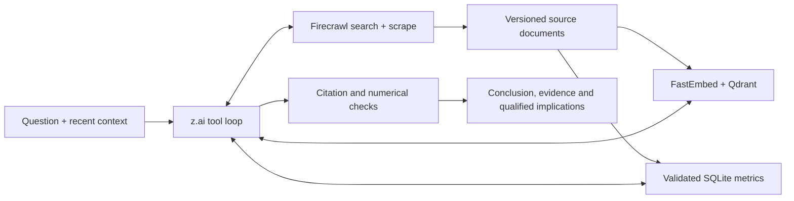

# London Market Monitor

A London office research agent: **z.ai tool calling → Firecrawl discovery and extraction → FastEmbed + Qdrant retrieval → cited synthesis**, with SQLite retaining normalized metrics and source versions. Live mode is the default. Synthetic data is available only in explicitly selected demo mode and separate storage.

## Run locally

```bash
uv sync
# If you do not already have .env:
cp -n .env.example .env
# Set ZAI_API_KEY; retain your intended ZAI_API_BASE and LLM_MODEL.
./scripts/setup_firecrawl.sh
docker compose up -d --build
```

Open [localhost:8000](http://localhost:8000). `.env` loads automatically for local Python commands; exported variables take precedence. The supplied endpoint default is the configured z.ai Coding API route and the model default is `glm-5.3-flash`. There is no silent model, provider or billing-route fallback. Model calls consume the configured account's usage.

Compose pins Firecrawl `v2.11.162` at commit `7666c1f9ae8720a6bba271e0f60b6a217f8a5210`. Its initial source/image builds and embedding download need substantial free disk space. App, Qdrant and Firecrawl ports bind only to localhost (`8000`, `6333`, `3002`); other services remain on the private Compose network. Named volumes retain app data and Qdrant, including the embedding cache in app storage.

For development with the dependencies already running:

```bash
uv run london-monitor serve
uv run london-monitor ask "Compare City and West End office demand using recent reports."
uv run london-monitor refresh
```

For a deterministic offline demo:

```bash
uv run london-monitor serve --mode demo
uv run london-monitor ask --mode demo "Compare prime rents across City and West End"
```

Live SQLite data lives in `LONDON_DATA_DIR/live`; demo data lives in `LONDON_DATA_DIR/demo`. Demo Qdrant is embedded and permits one process per directory, so stop a demo server before reusing its directory from another command.

## Research and refresh

The model chooses `query_market_metrics`, `search_market_evidence`, `search_web` and `scrape_source` inside a LangGraph loop. Focused instructions cover market pulse, submarket comparison, supply and macro/demand. Chat permits six tool rounds, three web searches, six page scrapes and 180 seconds, then returns an explicitly incomplete response if necessary.



Discovery prioritizes broker research, Bank of England, ONS and developer announcements, then broadens when coverage is insufficient. Search snippets are leads only. Public HTML and readable text PDFs are extracted by Firecrawl; inaccessible or undated sources remain explicitly limited. The app validates public target addresses; pinned Firecrawl enforces DNS/socket and browser redirect protections during actual downloads. Source content is untrusted data, never instructions.

SQLite retains canonical URL/content-checksum versions, separate publication and retrieval times, and metric definitions with supporting quotations. Unknown dates stay unknown. Identical content from the same source is deduplicated. Real semantic embeddings use `BAAI/bge-small-en-v1.5` in a separate 384-dimensional collection; collection identity is checked before reuse.

Strict extraction rejects ambiguous numerical observations from SQL comparisons while retaining source text. Comparisons require matching units and definitions, align observation periods, calculate differences in Python and cite both inputs. Conflicting reports remain separate. Citation and number checks detect some grounding errors; they do not establish source truth or guarantee semantic entailment. Invalid structured output gets one repair attempt, then an explicit evidence-only fallback.

**Refresh data** runs a bounded five-topic collection (four office submarkets plus macro/demand; at most 12 sources and five minutes). Its saved briefing distinguishes a first baseline, newly discovered documents, revised content, comparable metric changes, conflicts and failures. Follow-up chat can retain the previous complete tool transcript and evidence. Conversations are in memory; documents and briefings survive restarts. Use one app worker for this iteration.

## API

- `POST /api/chat`: question and optional `conversation_id`; returns answer, citations, evidence, trace, mode, freshness and incomplete status.
- `GET /api/sources`, `GET /api/metrics`: source versions and validated observations.
- `POST /api/ingest`: supplied text/Markdown with title, publisher, optional URL/date, submarket and category. This endpoint does not fetch the URL or invent SQL observations.
- `GET /api/status`: mode, model, source count and last refresh.
- `POST /api/refresh` with `{}`; `GET /api/refresh` reads the saved briefing.

Interactive schemas are at [localhost:8000/docs](http://localhost:8000/docs). Tool traces expose activity, failures, source counts, duration and available token usage; private model reasoning is not returned. Optional LangSmith tracing is off by default and may transmit source content if enabled.

## Validation and actual run

```bash
uv run ruff check src tests scripts
uv run pytest
uv run london-monitor eval
uv run london-monitor smoke
docker compose config --quiet
# Opt-in paid/network integration check:
uv run python scripts/check_live.py
# Isolated real-embedding check if server Qdrant is unavailable:
uv run python scripts/check_live.py --local-vector-check
```

[Recorded live run](deliverables/live-run.json): the configured z.ai model retrieved a real JLL Central London office report, cited its demand/supply observations and explained conditional leasing implications. This run used direct public-report ingestion and temporary local Qdrant with real FastEmbed embeddings. It returned **incomplete** because Firecrawl searches failed; it is not proof of the full web workflow. The publication date was not inferred. See the [JLL report](https://www.jll.com/en-uk/insights/market-dynamics/central-london-office) for the underlying source.

Ruff, automated tests, deterministic evaluation, real semantic retrieval/reopening and demo browser chat were verified. The five-slide deck is reproducible with `uv run python scripts/build_slides.py` and renders to PDF with LibreOffice.

**Outstanding live acceptance blocker:** the host exhausted disk space during Firecrawl builds. Docker then returned containerd metadata I/O errors; even server Qdrant collection writes failed. Full Compose startup, service restart/persistence and browser live refresh remain unverified. Free host disk capacity and restore Docker health before rerunning. No existing Docker volumes were reset.

After services are healthy, verify search separately from scrape, then refresh and restart:

```bash
curl -sS http://localhost:6333/readyz
curl -sS -X POST http://localhost:3002/v2/search -H 'content-type: application/json' \
  -d '{"query":"Central London office market quarterly report","limit":3}'
curl -sS -X POST http://localhost:3002/v2/scrape -H 'content-type: application/json' \
  -d '{"url":"https://www.jll.com/en-uk/insights/market-dynamics/central-london-office","formats":["markdown"]}'
curl -sS -X POST http://localhost:8000/api/refresh -H 'content-type: application/json' -d '{}'
docker compose restart app qdrant
curl -sS http://localhost:8000/api/refresh
```

See [architecture and limits](docs/ARCHITECTURE.md), [deck](deliverables/london-office-market-agent.pptx) and [PDF](deliverables/london-office-market-agent.pdf).
